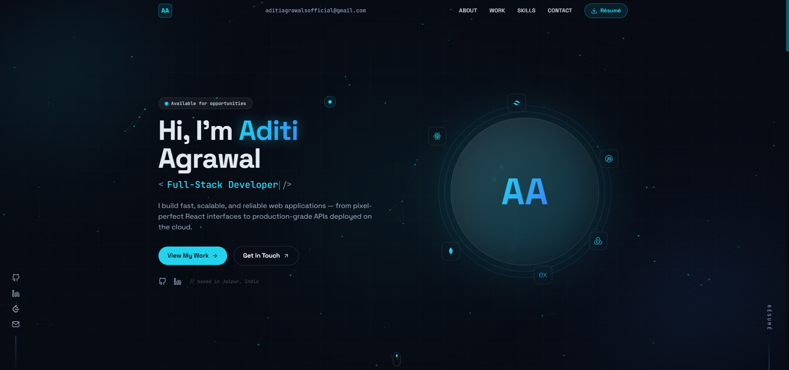

# Aditi Agrawal — Portfolio

A modern, animated single-page developer portfolio built with **React + Vite + Tailwind CSS + Framer Motion**. Dark "midnight + cyan" theme, custom cursor, particle background, scroll-driven timeline, pinned horizontal project gallery, and a cursor-spotlight tech grid.

🔗 **Live:** _add your deployed URL here_



## ✨ Features

- Custom glowing cursor + animated particle-network background
- Typewriter role headline and scroll-reveal animations throughout
- Animated stat counters, dashed corner-bracket service cards
- Scroll-driven career timeline with a glowing progress line
- **Horizontal pinned-scroll** project gallery (vertical stack on mobile)
- Tech-stack grid with a cursor-following spotlight
- Fully responsive, with a mobile hamburger menu
- Respects `prefers-reduced-motion`

## 🛠 Tech Stack

React 18 · Vite 5 · Tailwind CSS 3 · Framer Motion 11 · react-icons

## 🚀 Getting Started

```bash
npm install      # install dependencies
npm run dev      # start the dev server (http://localhost:5173)
npm run build    # production build → dist/
npm run preview  # preview the production build locally
```

## ✏️ Editing your content

**All text, links, projects, and skills live in [`src/data/info.js`](src/data/info.js)** — edit that one file; the components read from it. A few things to update there:

- `socials.linkedin` and `socials.leetcode` — replace the placeholder URLs with your real profiles.
- `projects[].links.live` — add live demo URLs (currently `#`).
- `profile.photoUrl` — drop a square photo in `public/` (e.g. `public/me.jpg`) and set this to `'./me.jpg'` to show your photo inside the hero ring instead of the "AA" initials.
- Your résumé is served from `public/resume.pdf` — replace that file to update it.

## 🎨 Re-theming

The entire accent color is driven by two CSS variables at the top of
[`src/index.css`](src/index.css). For example, to switch from cyan to violet:

```css
:root {
  --accent-rgb: 168 85 247;   /* violet */
  --accent-2-rgb: 236 72 153; /* pink   */
}
```

## 📦 Deploying

### Vercel (easiest)

1. Push this repo to GitHub.
2. Import it at [vercel.com/new](https://vercel.com/new) — Vercel auto-detects Vite.
3. Deploy. (Build command `npm run build`, output `dist` — auto-filled.)

### GitHub Pages (automated)

A workflow at `.github/workflows/deploy.yml` builds and publishes on every push
to `main`. To enable it:

1. Push to GitHub.
2. Go to **Settings → Pages → Build and deployment → Source → GitHub Actions**.
3. Your site goes live at `https://<username>.github.io/<repo>/`.

The build uses relative asset paths (`base: './'` in `vite.config.js`), so it
works at both a root domain (Vercel) and a project subpath (GitHub Pages)
without any changes.

---

Designed & built by Aditi Agrawal.
